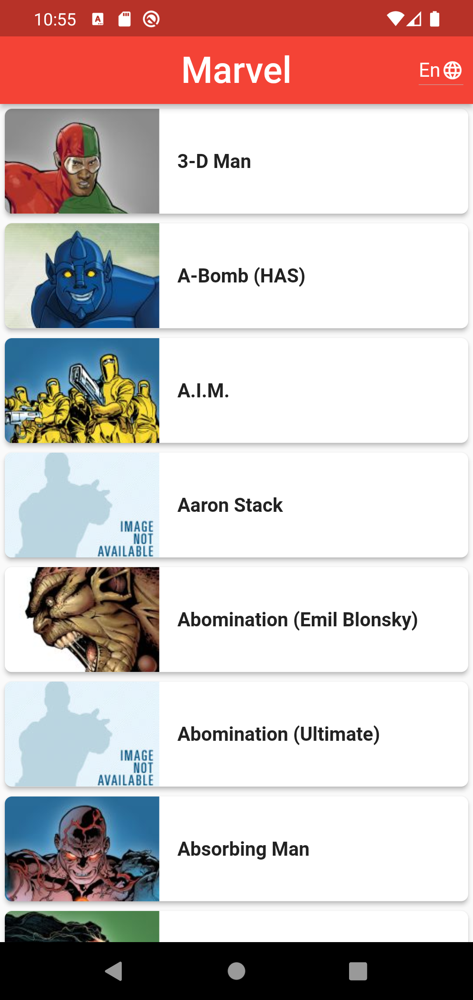
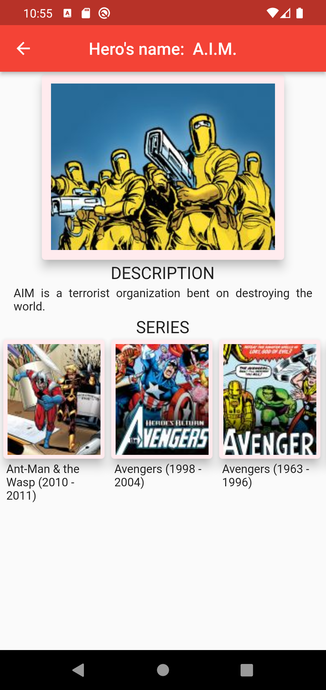
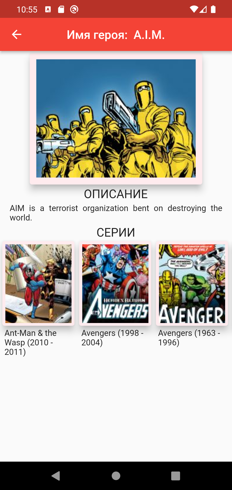

# marvel

- Marvel is an application that introduces characters from marvel universe using marvel api.
- I used clean architecture to create the project.


<div id="built-with"></div>

## Built With

* [Flutter](https://flutter.dev/)
* [Dart](https://dart.dev/)
* [Marvel API](https://developer.marvel.com/docs)

<div id="screenshots"></div>

## Screenshots

<p align='center'>
    
    
    
    
</p>

## Packages used
 - dio: ^4.0.6
 - equatable: ^2.0.3
 - intl: ^0.17.0
 - flutter_bloc: ^8.0.1
 - get_it: ^7.2.0
 - hive: ^2.2.1
 - hive_flutter: ^1.1.0
 - json_annotation: ^4.5.0
 - retrofit: ^3.0.1+1
 - build_runner: ^2.1.8
 - flutter_launcher_icons: ^0.9.3
 - flutter_lints: ^1.0.0 
 - hive_generator: ^1.1.3
 - json_serializable: ^6.1.5
 - retrofit_generator: ^4.0.1

## How to use

To clone and run this application, you'll need [Git](https://git-scm.com/downloads) and [Flutter](https://flutter.dev/docs/get-started/install) installed on your computer. From your command line:

```
# Clone this repository
$ git clone https://github.com/AlexMeshcharakou/flutter_marvel

# Go into the repository
$ cd flutter_marvel

# Install dependencies
$ flutter packages get

# Run the app
$ flutter run
```
